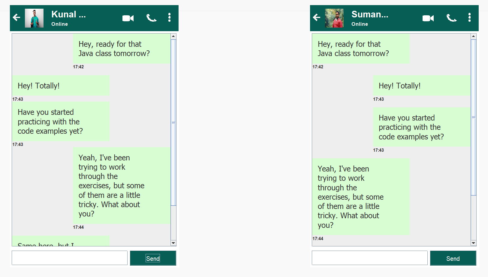

# Java Chatting Application (Client-Server GUI Based)

A simple real-time chat application built using **Java Socket Programming** and **Swing GUI**. This project features a client-server model that allows two users to exchange messages in real-time with a modern chat UI, similar to WhatsApp.

## App preview

##  Features

- 🧑‍💻 Real-time chat between server and client using TCP Sockets
- 💡 Intuitive and attractive GUI using Java Swing
- 🟢 Online status indicator
- 🕒 Timestamps for each message
- 📱 Rounded chat bubbles with auto-wrap text
- ⬆ Scrollable message panel for longer conversations
- ❌ Exit button with image icon
- 📷 Profile picture and interactive icons (video, call, more)

## Technologies Used

- Java (JDK 8+)
- Java Swing (GUI components)
- Java Sockets (TCP communication)
- AWT & Event Listeners
- Custom JPanel rendering for curved message boxes

